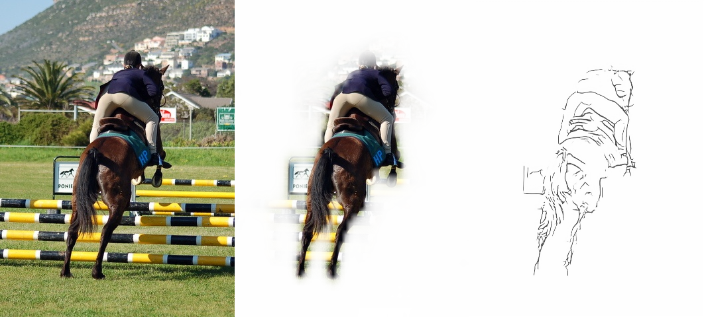
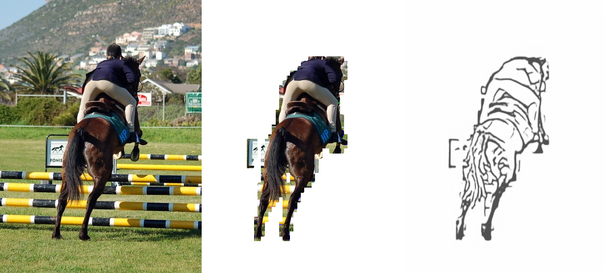

# Image to Sketch Network

## 1. File Explanation

##### Sketch Net

* **dataloader_skt:** The data-loader for Sketch Net, including data augmentation function
* **network:** The architecture of Sketch Net, resemble to pix2pix (cGAN) network
* **test:** Solo test for Sketch Net
* **tools:** Some functions to visualize/save images/process mask image

##### Mask Net

* **MaskNet/dataloader_mask:** Dataloader for mask net
* **MaskNet/DataGeneration:** Generate training dataset from COCO, it followed by class
* **MaskNet/MaskNetwork:** Shallow Mask Net, output mask size is 28 x 28
* **MaskNet/MaskNetwork2** Deepper Mask Net, output mask size is 56 x 56
* **train_mask, test_mask:** similar to above


## 2. Checkpoints Note:

* **MasNet_v2_notcentre: **The network trained on not centered mask image data. trained on 24/07/2021
* **MaskNet_v2_stage1**: The model trained on centered mask data and saved on halfway, seems not overfitting
* **MaskNet_v2_stage2:** The model saved after the full training, seems to have a serious overfitting


## 3. Usage

### Usage Note:

The network is mainly composed of "Mask Net" and "Sketch Net", among which Mask Net is an auxiliary function, so please keep the background of the input picture as simple as possible, and put the object you want to sketchize in the middle of the image. Otherwise the network will not have any idea of which object should be selected.

#### 1. pipeline.py

This file can run the whole process, i.e., ***Mask Net*** followed by ***Sketch Net***. Output images are in folder "output/Pipeline".

``` 
python pipeline.py --resolution 2 --cuda True --versio  2
```

**--datapath:** The path of folder which includes many or single test image (world images)

**--outpath:** Default value is "output/Pipeline/", you can also assign your own output folder

**--cuda:** Use or not use CUDA

**--version:** Mask Net version, "1" is 28x28 mask size, "2" is 56x56 mask size

**--maskmode:** 'soft' or 'hard', soft means crop foreground object with soft way, 'hard' method will case aliasing, but it will generate more clear boundary when it comes to Sketch Net.

**--softctr:** [0, 1]  float value. 0.3 means the pixel in mask image smaller 0.3 will be set to 0. smaller it is, bigger the object

**--resolution:** 1: 300x300, 2: 424x424, 3: 848x848, 4: 1272x1272.


## Results

High resolution with "soft" mask mode (824x824 input)



low resolution with "hard" mask mode, you can see the jagged boundary (424x424 input)




## 2021.8.2 update log

1）在“pipeline.py”文件中增加了background的选项，用于是否选择进行Mask Net操作

2）在pipeline.py中原先第96行左右的位置有一个Resize的步骤，但之前一直用的是242（Mask Net要求尺寸），所以其实当再Resize成不同大小输入Sketch Net的时候，已经是极度损失信息的了。所以之前大尺寸表现差就是因为这个。*我更新了这个错误以后，其实高分辨率图像已经表现很好了，但是我还继续训练600尺寸版本的 Sketch Net。*（上：有错误的，下：更新错误后的）


3）训练了600x600版本的Sketch Net，其中修改了D网络的loss，始得其不再对出入图像有要求，最终可以是以1x1或是2x2甚至更大的特征图为网络输出，只需要更改一下target，使用expand_as 变成同样大小即可。

4）在更新D网络的时候，开始忘记给G网络的输出detach()了，但感觉加了以后初期也没有影响很多，可以继续探索一下之后。

5）我发现将图片调黑之后再过网络效果会好挺多（暂时用的PS）

## 2021.8.3 update log

### 针对改善小动物等细节不足问题

 1）尝试从训练数据集入手，对训练集生成的过程中：（UCL_Generation/no_mask_pipeline.py文件中）

* 在RGB原图上加入直方图均衡，效果不明显
* 在RGB原图上调低亮度，效果几乎没有
* 在pencil图（即图像处理之后的图）上抑制噪声后做直方图均衡，效果很明显，但同时对噪声的放大也不含糊，基本上不能用，处理人像如此，处理交通工具等可想而知。
* 结论：还是保留原有的gamma变换最有效

2）在测试时做出改变，即改变输入进网络的图片：（在MySketch/pipeline.py文件中直接修改的）

* 原来输入图片都没有做gamma变换，这是最大的问题之一，补上了效果有所起色！但对于羊等过度曝光的图还是细节不构明显。（**记得只给Sketch Net做gamma变换，Mask Net不需要，否则mask将不准确**）
* 使用“正片+负片”处理后再使用bitwise_and()方法，细节全部到位，但缺点就是会出现“双轮廓”！处理羊这些很好，但是处理交通工具就要斟酌使用，因为会出现很多双线条。所以我的想法是让用户自己选择处理方案。

3）测试新训练出来的600x600网络

* 有可能是训练次数太多，也有可能是G与D的loss不均衡的原因（D的loss最后非常小已经是0，而G的loss还维持一定水平），也可能是由于新改变了D的loss function，**这个新训练出的网络会很倾向于画出物体很黑暗的部分，即涂色，出来的效果就和使用原来训练的网络以424x的输入差不多，虽然图片尺寸增加，但分辨率并没有提高。**
* 当我使用二倍于它的输入（1200x）进行测试时，测试结果和之前差不多，线条变细，细节增加。（但是还是有点倾向于画出涂色的地方）。总之更倾向于使用之前的
* 结论：没有必要在训练时调节输入图片尺寸，重点在测试时改变会达到不同的细节效果。

## 2021.8.4 update log

#### 输出说明

在 “output/Pipeline_and_vectorize” 文件夹中有两个文件夹，分别是在 848x 分辨率输入进入Sketch Net和 424x分辨率输入的区别。对于Vectorize的输入图片尺寸，都为600x，使用的是第一版训练网络权重。测试图像都是iphone手机拍摄图片。

在每个文件夹中又有这么几个分类：

* gallery：三联横排显示（但没有最后的vector显示）
* gif: vectorize后的gif动图
* seq_data：都为npz格式数据，存储笔画的原始文件
* sketch：图片经过Sketch网络之后的原始输出
* vector：相当于把gif的最后一帧保存下来了，静态图
